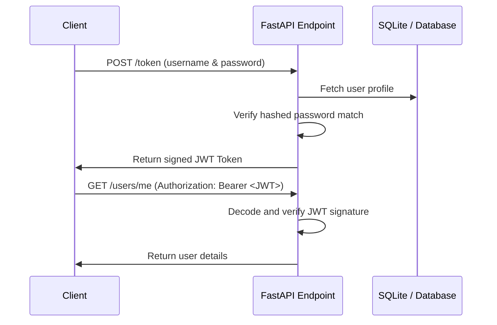

# Topic 05: Security & Authentication

This module details how to implement security, token signing, and user authentication strategies in FastAPI.

---

## Code Walkthrough

1. **[01_api_keys.py](file:///Users/saikrishnakuchimanchi/Downloads/Test/Fastapi/05_security_and_auth/01_api_keys.py)**
   * Demonstrates simple header-based and query-based API Key validation utilizing dependency injection.
2. **[02_oauth2_jwt.py](file:///Users/saikrishnakuchimanchi/Downloads/Test/Fastapi/05_security_and_auth/02_oauth2_jwt.py)**
   * A full implementation of the **OAuth2 Password Bearer** flow. It covers:
     * Password hashing (using `passlib`).
     * Creating JWT (JSON Web Tokens) with signatures and expirations (using `pyjwt`).
     * Retrieving and validating the current user profile from a token dependency.

---

## Auth Workflows

* Under the hood, FastAPI provides helper security abstractions (`HTTPBearer`, `OAuth2PasswordBearer`, `APIKeyHeader`) to seamlessly read authorization inputs and integrate with the OpenAPI/Swagger interactive UI.
